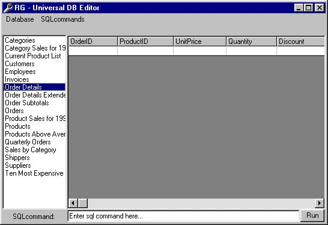



## \[\[ a Universal DB Editor

### Description

Used to edit any SQL supported database. Needs a bit more to be complete but its a good start.

I will get back to you when finishing the app.

Comments pleace!!
 
### More Info
 

             |
---                |---
**Submitted On**   |2002-10-25 12:48:58
**By**             |[Pamela RAI](https://github.com/Planet-Source-Code/PSCIndex/blob/master/ByAuthor/pamela-rai.md)
**Level**          |Advanced
**User Rating**    |4.1 (37 globes from 9 users)
**Compatibility**  |VB 4\.0 \(32\-bit\), VB 5\.0, VB 6\.0
**Category**       |[Complete Applications](https://github.com/Planet-Source-Code/PSCIndex/blob/master/ByCategory/complete-applications__1-27.md)
**World**          |[Visual Basic](https://github.com/Planet-Source-Code/PSCIndex/blob/master/ByWorld/visual-basic.md)
**Archive File**   |[\[\[\_a\_Unive14873710262002\.zip](https://github.com/Planet-Source-Code/pamela-rai-a-universal-db-editor__1-40170/archive/master.zip)

